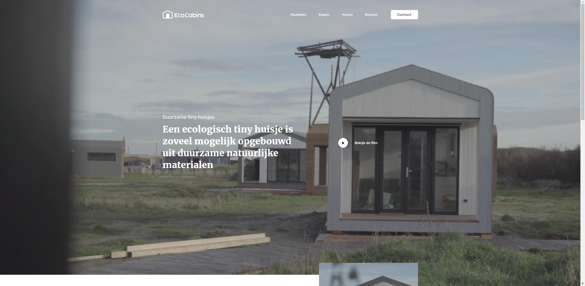
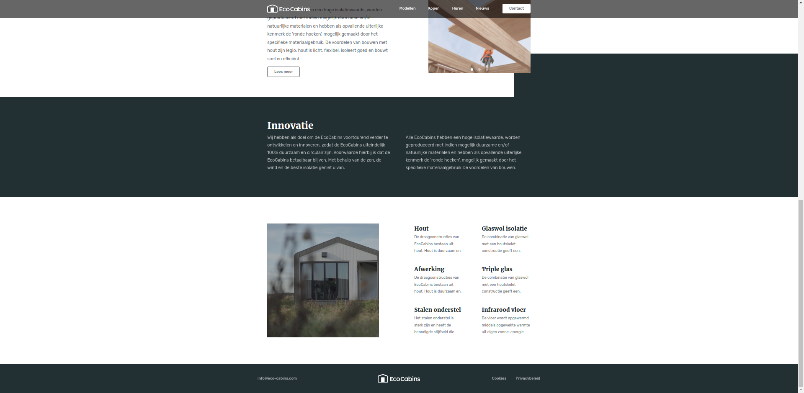
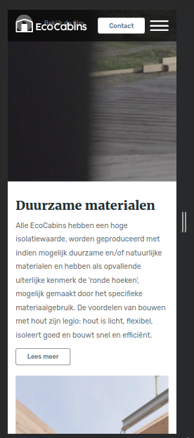
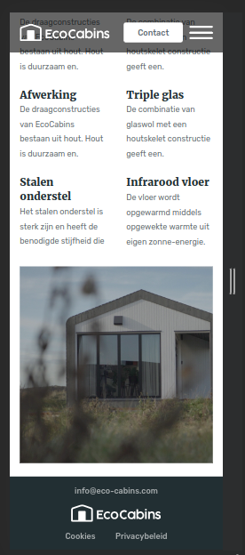
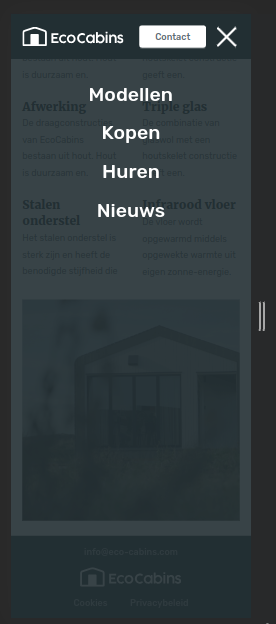

# Цей проєкт було розроблено по тестовому макету
___

#### У ході проєктування були зроблені, наступні кроки:
- Всі налаштування та збірка проєкту були реалізовані за допомогою інструменту **Gulp**
- Дотримуючись методології **БЕМ**, було створено консистентну структуру проєкту
- Було впроваджено принцип mobile-first для більшості блоків проекту
- Використано препроцесор **SCSS** для написання усіх стилів, що полегшить розробку та підтримку коду
- Додано **вендорні префікси** до CSS властивостей для останніх трьох версій браузерів, щоб забезпечити їхню сумісність
- Стилізація **media-запитів** була організована та згрупована для підвищення зручності розробки
- Реалізовано **адаптивність** та **базову анімацію**, що покращує візуальний вигляд та користувацький досвід
- Файли ***.css*** та ***.js*** були оптимізовані та стиснуті для поліпшення продуктивності сайту
- Інтегровано зовнішній код, для підключення і налаштування слайдера

#### Обробка зображень та шрифтів
- Впроваджено оптимізацію завантаження шрифтів з **Google Fonts**
- Оптимізовано (стиснуто)  всі ***.jpg*** та ***.png*** зображення
- Перетворено растрові зображення у формат ***.webp***
- Додано підтримку ***.webp*** для зображень у випадку, якщо браузер їх підтримує
___

## Декілька скріншотів результату

#### Desctop:

#### Mobile:

